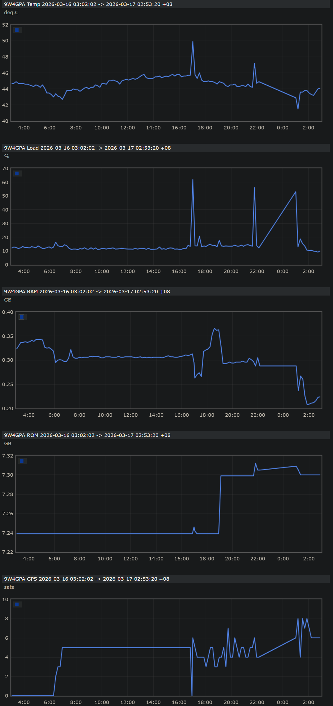

# RasPiAPRS

With this simple python program you can monitor your Pi-Star / WPSD / AllStarLink health using APRS metrics.

You can see an example of the metrics logged by my WPSD node [9W4GPA](https://aprs.fi/telemetry/a/9W4GPA?range=day).

The metrics are:-

1. CPU temperature
2. CPU load (average 15 minutes)
3. Memory used
4. Disk usage
5. GPS used (optional)

## Requirements

The following packages are required:

- `gcc`
- `git`
- `python3-dev`
- `curl`
- `uv`

The startup script will attempt to install them automatically if they are missing.

Note: to install uv using `apt`, you may use `debian.griffo.io` repository.

```bash
curl -sS https://debian.griffo.io/EA0F721D231FDD3A0A17B9AC7808B4DD62C41256.asc | sudo gpg --dearmor --yes -o /etc/apt/trusted.gpg.d/debian.griffo.io.gpg

echo "deb https://debian.griffo.io/apt $(lsb_release -sc 2>/dev/null) main" | sudo tee /etc/apt/sources.list.d/debian.griffo.io.list

sudo apt update && sudo apt install uv
```

## Installation (Pi-Star / WPSD / AllStarLink)

```bash
git clone https://github.com/HafiziRuslan/RasPiAPRS.git raspiaprs
cd raspiaprs
```

Mirror Repositories (delayed daily update):

- GitLab: <https://gitlab.com/hafiziruslan/RasPiAPRS>
- Codeberg: <https://codeberg.org/hafiziruslan/RasPiAPRS>
- Gitea: <https://gitea.com/HafiziRuslan/RasPiAPRS>

## Configurations

Copy the file `.env.sample` into `.env`, and edit the configuration using your favorite editor.

```bash
cp .env.sample .env
nano .env
```

## Starting RasPiAPRS

```bash
sudo ./main.sh
```

note: `sudo` required to access `/tmp` and `/var/log` directories.

## AutoStart RasPiAPRS

Copy & Paste this line into last line (before blank line) of `/etc/crontab` or any other cron program that you're using.

```bash
@reboot pi-star cd /home/pi-star/raspiaprs && ./main.sh > /tmp/raspiaprs.log 2>&1
```

change the `pi-star` username into your username

## Update RasPiAPRS

Manual update are **NOT REQUIRED** as it has integrated into `main.sh`.

Use this command for manual update:-

```bash
git pull --autostash
```

## Example

This is the screenshoot from `aprs.fi` of _CPU temperature_, _CPU load average_, _Memory used_, _Disk usage_ and _GPS usage_ from an WPSD node.


### Source

[0x9900/aprstar](https://github.com/0x9900/aprstar)
