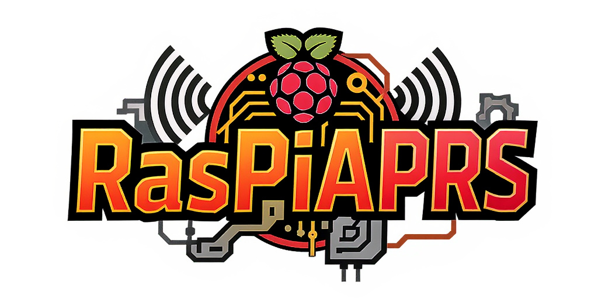

# RasPiAPRS

<div style="text-align: center;">




</div>

<table style="margin-left: auto; margin-right: auto;">
  <tr><th colspan="2" style="text-align: center;">Mirrors (daily update)</th></tr>
  <tr><td style="text-align: end;">GitLab</td><td><a href="https://gitlab.com/hafiziruslan/RasPiAPRS">hafiziruslan/RasPiAPRS</a></td></tr>
  <tr><td style="text-align: end;">Codeberg</td><td><a href="https://codeberg.org/hafiziruslan/RasPiAPRS">hafiziruslan/RasPiAPRS</a></td></tr>
  <tr><td style="text-align: end;">Gitea</td><td><a href="https://gitea.com/HafiziRuslan/RasPiAPRS">HafiziRuslan/RasPiAPRS</a></td></tr>
</table>

## About

**RasPiAPRS** is a monitoring tool designed for Raspberry Pi nodes running radio software such as Pi-Star, WPSD, or AllStarLink. It tracks system health and location data, broadcasting this information over the APRS network.

## Key Functions

* **Telemetry Tracking**: Monitors specific hardware metrics including CPU temperature/load, memory/disk usage, and network traffic.
* **SmartBeaconing**: Reduces network congestion by dynamically adjusting beacon frequency based on the station's speed and heading.
* **Dynamic Symbols**: Automatically switches the APRS map icon (e.g., stationary vs. moving) based on real-time GPS motion.
* **Remote Alerts**: Supports Telegram Bot API for sending system status updates directly to your device.
* **Visualization**: Formats and logs telemetry data for display on platforms like `aprs.fi`.

You can see an example of the metrics logged by my WPSD node [9W4GPA](https://aprs.fi/telemetry/a/9W4GPA?range=day).

## Requirements

The following packages are required for the application to interface with hardware and manage dependencies:

* `curl` & `git`: Used for initial installation and the integrated self-updating mechanism.
* `gcc` & `python3-dev`: Required to compile Python C-extensions for system monitoring libraries.
* `gpsd` & `gpsd-clients`: Interfaces with GPS hardware to provide location and timing data.
* `uv`: A high-performance Python package installer used to manage application dependencies.
* `vnstat`: A network traffic monitor used to report data usage in telemetry.

The startup script will attempt to install them automatically if they are missing.

Note: to install uv using `apt`, you may use `debian.griffo.io` repository.

```bash
curl -sS https://debian.griffo.io/EA0F721D231FDD3A0A17B9AC7808B4DD62C41256.asc | sudo gpg --dearmor --yes -o /etc/apt/trusted.gpg.d/debian.griffo.io.gpg
echo "deb https://debian.griffo.io/apt $(lsb_release -sc 2>/dev/null) main" | sudo tee /etc/apt/sources.list.d/debian.griffo.io.list
sudo apt update && sudo apt install uv
```

## Installation

```bash
git clone https://github.com/HafiziRuslan/RasPiAPRS.git
cd RasPiAPRS
```

## Configuration

Copy the sample environment file and edit it with your credentials and station settings.

```bash
cp .env.sample .env
nano .env
```

## Starting

Run the startup script with `sudo`. The script will automatically check for system dependencies, update the application, and manage the Python virtual environment.

```bash
sudo ./main.sh
```

## AutoStart

To ensure the script starts automatically after a reboot, add the following line to `/etc/crontab` (or your preferred cron manager).

```bash
@reboot pi-star cd /home/pi-star/RasPiAPRS && ./main.sh 2>&1
```

*Note: Replace `pi-star` with your actual system username if different.*

## Update

Manual updates are generally **not required** as `main.sh` performs a check every time it starts. To force a manual update:

```bash
git pull --autostash
```

## Telemetry Example

This is the screenshot taken from `aprs.fi` of _CPU temperature_, _CPU load average_, _Memory used_, _Disk usage_ and _GPS usage_ from my WPSD node.

<div style="text-align: center;">


</div>

## Hardware used for testing

1. Raspberry Pi Zero 2 W
2. Waveshare SIM7600G-H 4G HAT (B)
3. Geekworm X306 18650 UPS
4. MMDVM Duplex Dual HAT
5. Nextion NX4024K032

## Source

[0x9900/aprstar](https://github.com/0x9900/aprstar)
