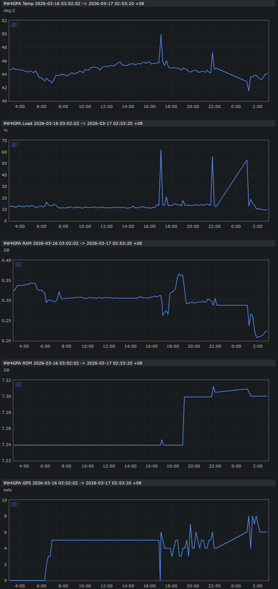

# RasPiAPRS


With this simple python program you can monitor your Pi-Star / WPSD / AllStarLink health using APRS metrics.

- The metrics are:
  1. CPU temperature (average 10 minutes)
  2. CPU load (average 10 minutes)
  3. Memory used (average 10 minutes)
  4. Disk usage
  5. GPS used [optional]

You can see an example of the metrics logged by my WPSD node [9W4GPA](https://aprs.fi/telemetry/a/9W4GPA?range=day).

Mirrors (daily update):

- GitLab: <https://gitlab.com/hafiziruslan/RasPiAPRS>
- Codeberg: <https://codeberg.org/hafiziruslan/RasPiAPRS>
- Gitea: <https://gitea.com/HafiziRuslan/RasPiAPRS>

## Requirements

The following packages are required:

- `curl`
- `gcc`
- `git`
- `python3-dev`
- `uv`
- `vnstat`

The startup script will attempt to install them automatically if they are missing.

Note: to install uv using `apt`, you may use `debian.griffo.io` repository.

```bash
curl -sS https://debian.griffo.io/EA0F721D231FDD3A0A17B9AC7808B4DD62C41256.asc | sudo gpg --dearmor --yes -o /etc/apt/trusted.gpg.d/debian.griffo.io.gpg

echo "deb https://debian.griffo.io/apt $(lsb_release -sc 2>/dev/null) main" | sudo tee /etc/apt/sources.list.d/debian.griffo.io.list

sudo apt update && sudo apt install uv
```

## Installation (Pi-Star / WPSD / AllStarLink)

```bash
git clone https://github.com/HafiziRuslan/RasPiAPRS.git RasPiAPRS
cd RasPiAPRS
```

## Configurations

Copy the file `.env.sample` into `.env`, and edit the configuration using your favorite editor.

```bash
cp .env.sample .env
nano .env
```

## Starting RasPiAPRS

```bash
sudo ./main.sh
```

note: `sudo` required for write access on `/var` directories.

## AutoStart RasPiAPRS

Copy & Paste this line into last line (before blank line) of `/etc/crontab` or any other cron program that you're using.

```bash
@reboot pi-star cd /home/pi-star/RasPiAPRS && ./main.sh 2>&1
```

change the `pi-star` username into your username

## Update RasPiAPRS

Manual update are **NOT REQUIRED** as it has integrated into `main.sh` and will be run before application started.

Use this command for manual update:-

```bash
git pull --autostash
```

## Telemetry Example

This is the screenshot taken from `aprs.fi` of _CPU temperature_, _CPU load average_, _Memory used_, _Disk usage_ and _GPS usage_ from my WPSD node.


## Hardware used for testing

1. Raspberry Pi Zero 2 W
2. Waveshare SIM7600G-H 4G HAT (B)
3. Geekworm X306 18650 UPS
4. MMDVM Duplex Dual HAT
5. Nextion NX4024K032

## Source

[0x9900/aprstar](https://github.com/0x9900/aprstar)
